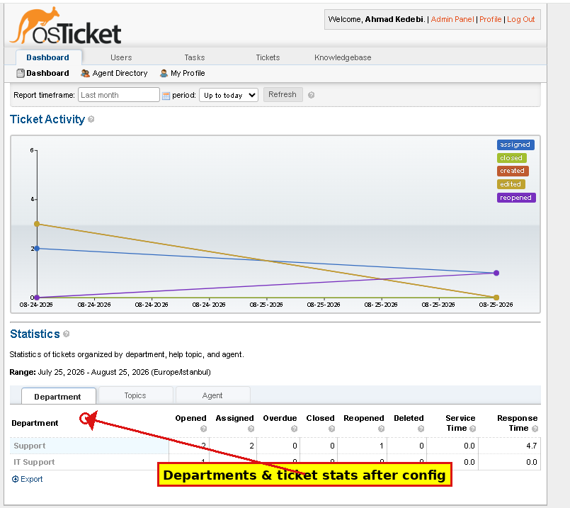
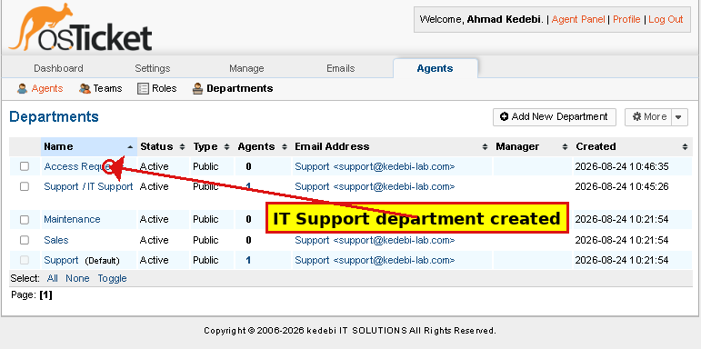
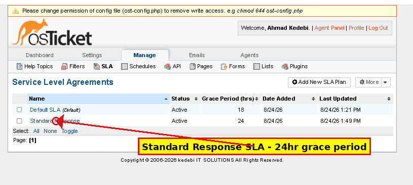
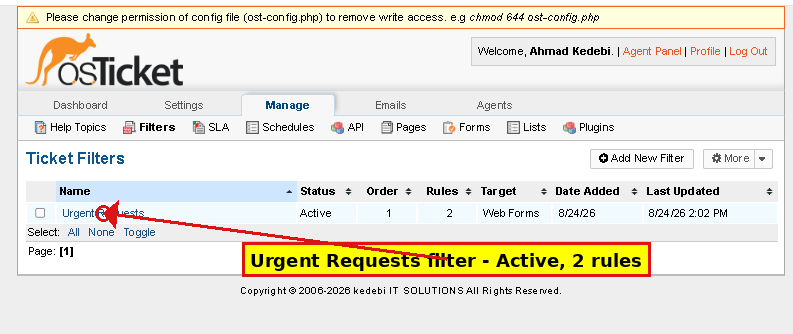

# osTicket — Post-Installation Configuration

## Overview
This project documents the post-installation configuration of the osTicket help desk platform — turning a bare installation into a functioning support system with departments, SLA policies, automated ticket routing, staff accounts, and email settings.

## Objective
Configure osTicket's core operational settings so the help desk can realistically receive, route, and manage support tickets, mirroring how a real IT support team would set up a ticketing system.

## Environment
- **Platform:** osTicket v1.18.1, self-hosted on Ubuntu (Azure VM `osticket01`)
- **Admin Panel:** `http://<server-ip>/scp/`

## Configuration Steps

### 1. General/Company Settings
Configured the company name and default timezone in Admin Panel → Settings, and confirmed the helpdesk status was set to Online.

### 2. Departments
Created two departments under Admin Panel → Agents → Departments:
- **IT Support** — general technical support requests
- **Access Requests** — identity and access-related requests

### 3. SLA Plan
Created a default SLA plan under Admin Panel → Manage → SLA Plans:
- **Name:** Standard Response
- **Grace period:** 24 hours

This SLA plan is automatically applied to new tickets and drives the "Due Date" shown on each ticket.

### 4. Ticket Filter
Created an automated ticket filter under Admin Panel → Manage → Ticket Filters:
- **Name:** Urgent Requests
- **Match condition:** Subject contains "urgent"
- **Actions:** Set Department to IT Support, set Priority to High, assign Team to Level I Support

This filter was later validated in the Ticket Lifecycle & SLAs project, where it correctly auto-routed a test ticket with zero manual intervention.

### 5. Staff/Agent Account
Created a second staff account under Admin Panel → Agents → Add New Agent:
- **Username:** supportagent1
- **Department:** IT Support
- **Role:** Agent (non-admin)

This separates ticket-handling staff from the administrator account, reflecting a realistic multi-agent support team structure.

### 6. Email Configuration
Added a support email identity under Admin Panel → Emails:
- **Email Address:** support@kedebilab.local
- **Department:** IT Support

Mail fetching (IMAP/SMTP) was left disabled since this is a lab environment without a live mail server — the email identity still functions correctly as a ticket-routing address for tickets created through the web portal.

## Key Findings
- SLA plans and ticket filters work together automatically: once configured, they require no manual triage for tickets matching filter conditions.
- Separating admin and agent accounts is important both for security (least privilege) and for realistic workflow simulation — agents only see tickets in their assigned department.
- Department structure directly drives filter logic and staff visibility, so planning departments before filters and agents is the correct configuration order.

## Skills Demonstrated
- Help desk system administration and configuration
- SLA policy design
- Rule-based automation (ticket filters)
- Role-based access setup (agent vs. admin accounts)
- Email routing configuration in a ticketing system

## Status
Complete
